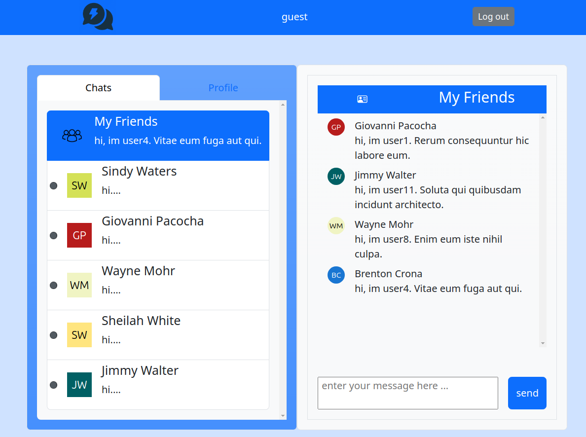

# MessageMe Messenger / Odin-Rails-Messaging-App
- An full-stack web application for users to send message to each other , this is part of projects built along [TheOdinProject Course](https://www.theodinproject.com/lessons/react-new-messaging-app).

## Live DEMO :

Full Stack Ruby on Rails : https://odin-rails-messaging-app.onrender.com/

## Tech Stack :
1. FrontEnd (React + React Router + Bootstrap)
1. BackEnd (Ruby on Rails + PostgreSQL)

### Current feature:

- basic Create & Read of Chat & GroupChat
- basic Create & Read of Message
- basic Create & Read, Update of User
- User Auth with JWT

### Gem used:
- devise
- faker
- bootstrapcss
- more, refer to gem file

### Test:
- un-tested

### Repo:

## Installation 
### Prerequisite:
- Have postgreSQL, Ruby, Rails installed

### Steps
1. Clone the repo
1. cd odin-rails-messaging-app
1. bundle install
1. Create .env file like .env-sample
1. rails db:migrate:reset
1. rails db:seed
1. ./bin/dev
1. visit at http://localhost:3000
1. update /app/javascript/layout/API_URL.jsx to ur server domain

# Source:
- repo: https://github.com/WongYC-66/odin-rails-messaging-app/

# Thanks
https://www.digitalocean.com/community/tutorials/how-to-set-up-a-ruby-on-rails-v7-project-with-a-react-frontend-on-ubuntu-20-04

https://sdrmike.medium.com/rails-7-api-only-app-with-devise-and-jwt-for-authentication-1397211fb97c